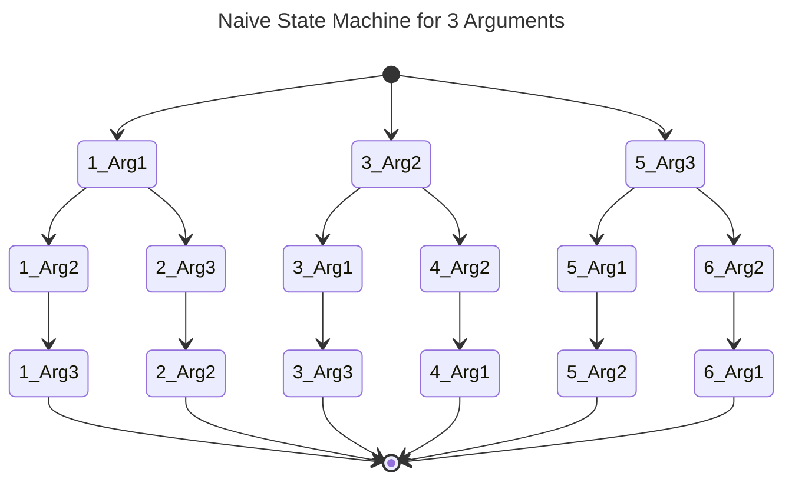
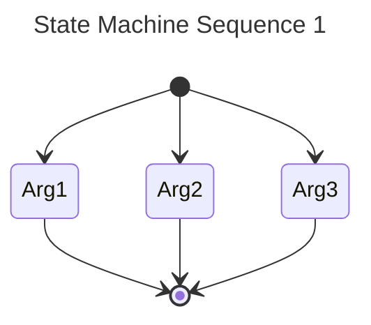
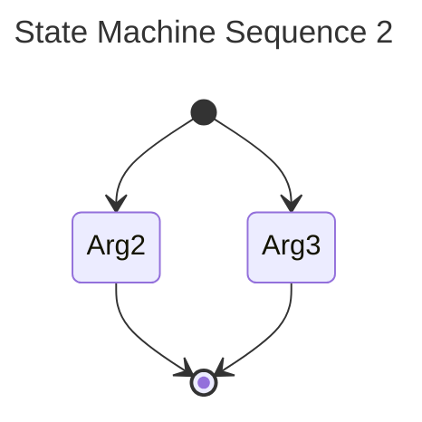
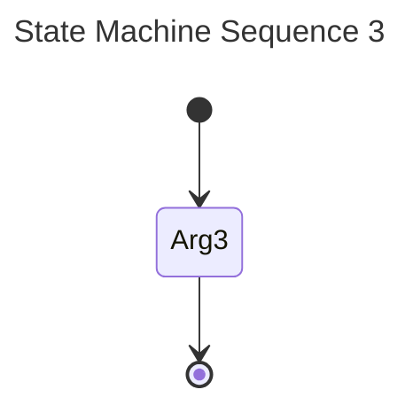

# Argument Parser Design

We want to represent the argument parser as a state machine.
However, the naive approach leads to a extremely huge state machine with lots of redundant states.
For example, if we have a program with 3 mandatory cli arguments, then we have $3! = 6$ possible paths leading to an accepting state. In total we would have $n \cdot (\Sigma_{i=2}^{n} i) = 3 \cdot (3 + 2) = 15$ states.
This is leadst to a combinatorial explosion and I am too lazy to deal with this.

Therefore, I propose a simpler idea.
Instead of one large state machinem we use a sequence of small state machines.
Basically, we always use the same state machine, but remove paths which were already used.

Lets say we picked Arg1 first. Then the next state machine would be:

Finally, the last state machine would be: 

This makes parsing very simple and short.